### Práctica UD10 – Servidor de ficheros con Samba

**Alumno:** Santiago Hernandez  
**Número de lista:** 10

***

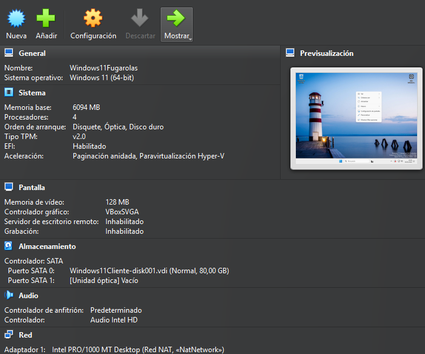 

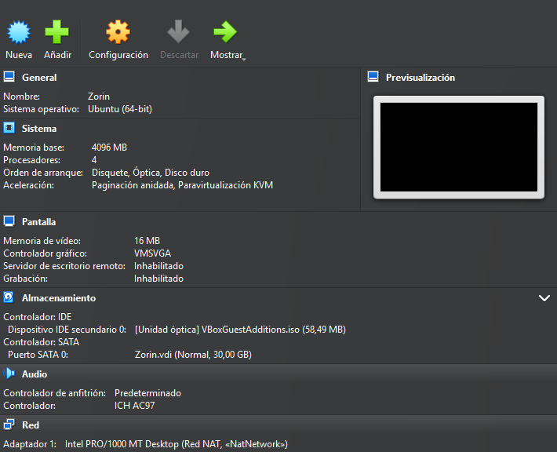 

## 1. Preparación del entorno

Antes de comenzar con la instalación de Samba, se ha verificado la configuración de red de ambas máquinas (Zorin y Windows 11).

Ambas máquinas están configuradas en **modo NAT**, lo que permite que se comuniquen dentro de la misma red virtual.

En Zorin se ejecuta:

```
ip a
```

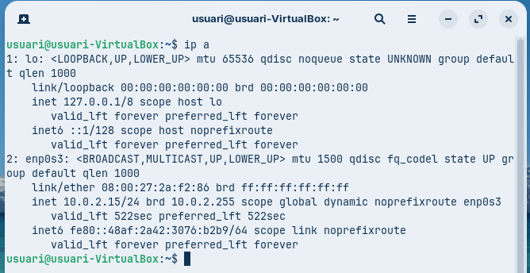 

Y en Windows:

```
ipconfig
```

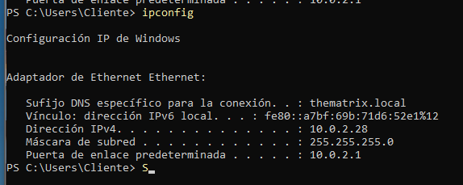 

Resultado:

* Zorin: 10.0.2.15
* Windows: 10.0.2.28

Se comprueba conectividad mediante ping desde Windows hacia Zorin:

```
ping 10.0.2.15
```

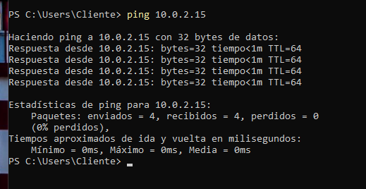 

El resultado es correcto. El ping en sentido contrario puede fallar debido al firewall de Windows, pero no afecta a Samba.

***

## 2. Instalación de Samba

Se procede a instalar Samba en Zorin.

```
sudo apt update
sudo apt install samba -y
```

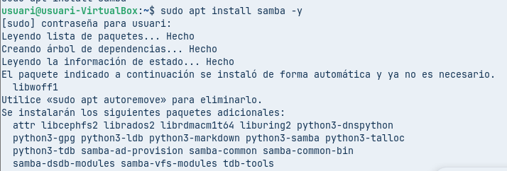 

Se comprueba la versión instalada:

```
smbd --version
```

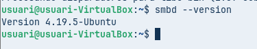 

Y el estado del servicio:

```
systemctl status smbd
```

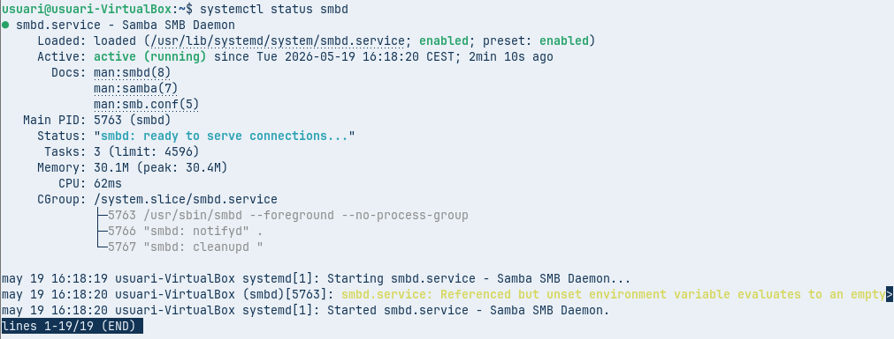 

El servicio debe aparecer como activo (running).

***

## 3. Creación de estructura de carpetas

Se crean los directorios necesarios:

```
sudo mkdir -p /srv/samba/publica
sudo mkdir -p /srv/samba/compartida
```

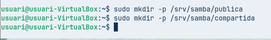 

Se crea el grupo:

```
sudo groupadd sambashare
```

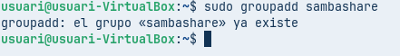 

Se asignan propietario y grupo:

```
sudo chown root:sambashare /srv/samba/publica
sudo chown root:sambashare /srv/samba/compartida
```

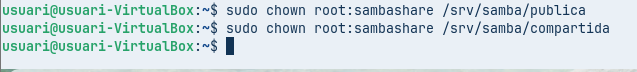 

Se asignan permisos:

```
sudo chmod 770 /srv/samba/publica
sudo chmod 770 /srv/samba/compartida
```

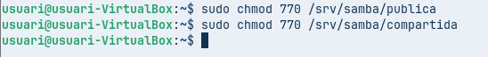 

Verificación:

```
ls -ld /srv/samba/*
```

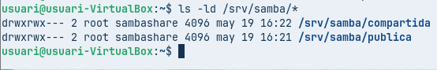 

Se comprueba que los permisos son `drwxrwx---` y el grupo es `sambashare`.

***

## 4. Creación de usuarios

Se crean los usuarios requeridos sin acceso interactivo:

```
sudo useradd -m -s /sbin/nologin -G sambashare samba1
sudo useradd -m -s /sbin/nologin -G sambashare samba2
sudo useradd -m -s /sbin/nologin -G sambashare samba3
```

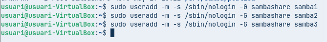 

Se añaden a Samba:

```
sudo smbpasswd -a samba1
sudo smbpasswd -a samba2
sudo smbpasswd -a samba3
```

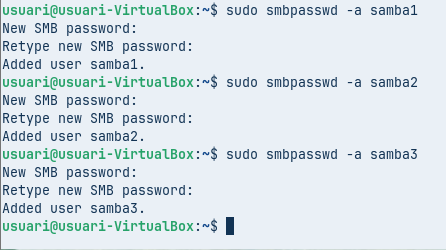 

Verificación:

```
cat /etc/passwd | grep samba
groups samba1
```

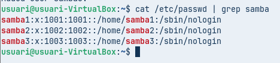 

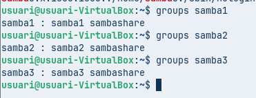 

***

## 5. Configuración base de Samba

Se realiza una configuración limpia:

```
sudo mv /etc/samba/smb.conf /etc/samba/smb.conf.bak
sudo nano /etc/samba/smb.conf
```

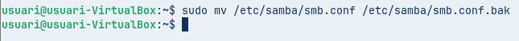 

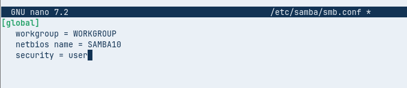 

Contenido:

```
[global]
   workgroup = WORKGROUP
   netbios name = SAMBA10
   security = user
```

Validación:

```
testparm
```

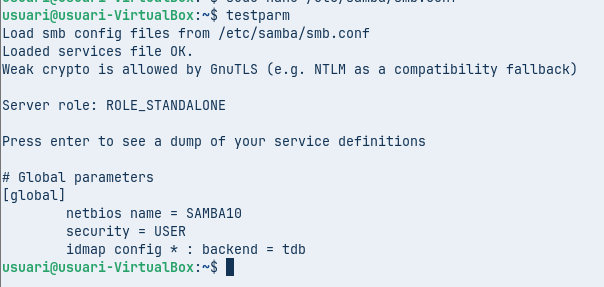 

Reinicio:

```
sudo systemctl restart smbd
```

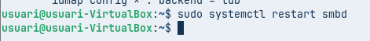 

***

## 6. Carpeta pública

Se configura la carpeta pública con acceso restringido por usuario (evitando problemas de acceso anónimo en Windows 11):

```
[publica]
   path = /srv/samba/publica
   browsable = yes
   read only = yes
   valid users = samba1 samba2 samba3
```

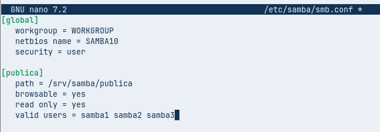 

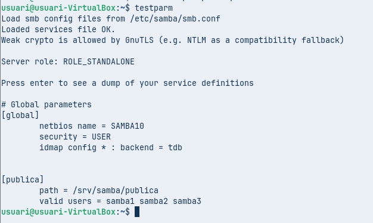 

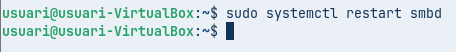 

Se crea un archivo de prueba:

```
sudo nano /srv/samba/publica/prueba.txt
```

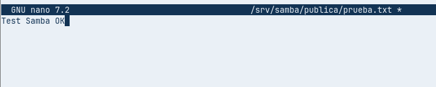 

Desde Windows CMD:

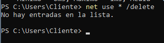 

```
net use * /delete
```

Desde Windows en el Explorador de archivos:

```
\\10.0.2.15\publica
```

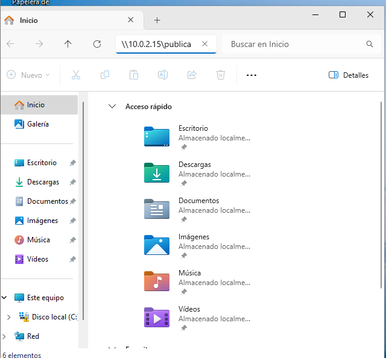 

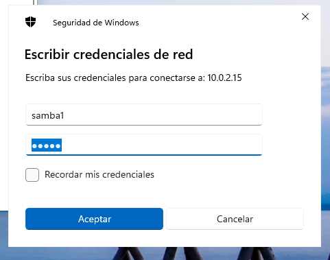 

Resultado:

* Acceso correcto
* Lectura permitida

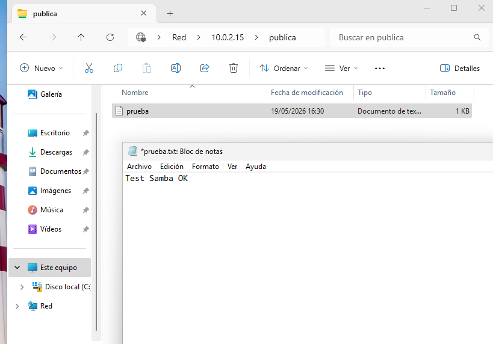 

* Escritura denegada

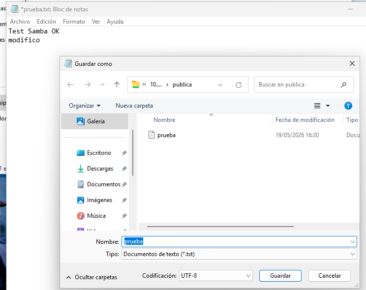 

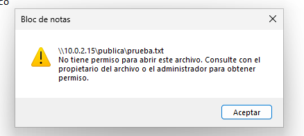 

***

## 7. Carpetas personales

Se configura el acceso a los directorios home:

```
[homes]
   browseable = no
   read only = no
```

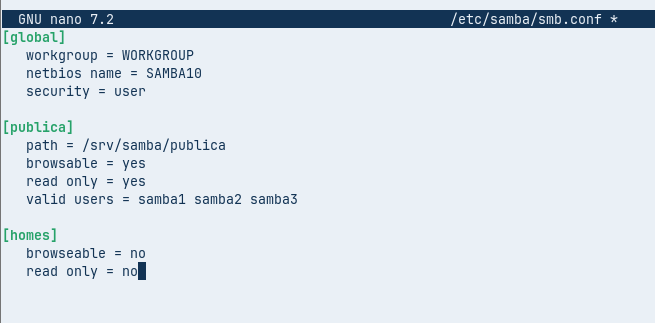 

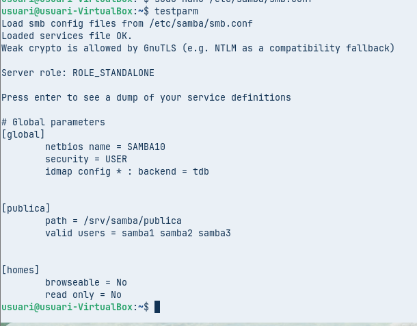 

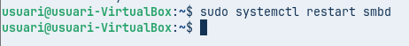 

Explicación:

* Cada usuario accede únicamente a su carpeta

Prueba:

```
\\10.0.2.15\samba1
```

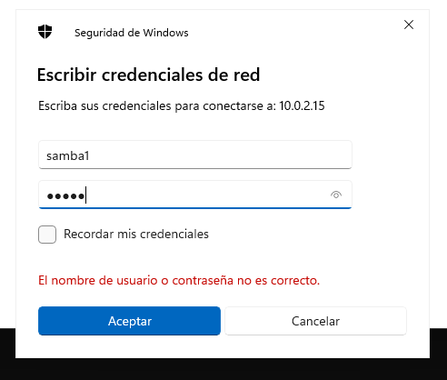 

Resultado:

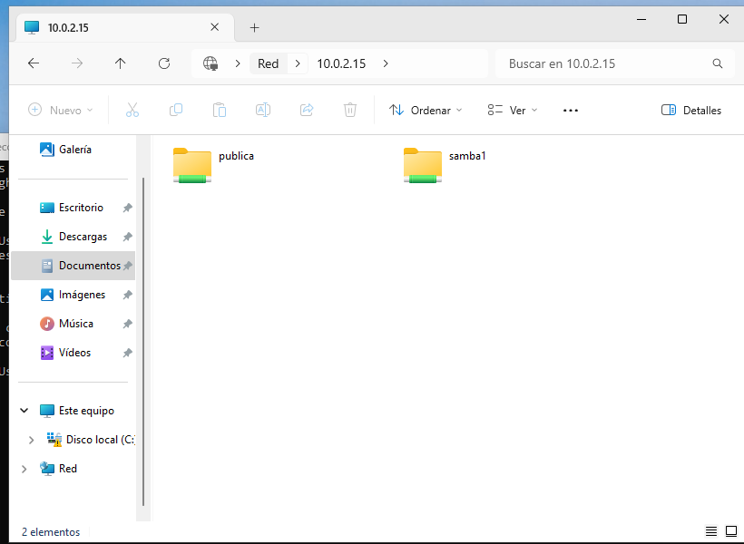 

* Acceso correcto al directorio propio
* Acceso denegado al resto

***

## 8. Carpeta compartida con control de permisos

Configuración:

```
[compartida]
   path = /srv/samba/compartida
   browsable = yes
   read only = yes
   valid users = samba1 samba2
   write list = samba1
   force group = sambashare
```

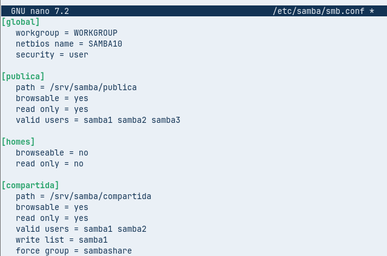 

Problema detectado:
Los archivos creados inicialmente pertenecían a root, lo que impedía su modificación.

Solución aplicada:

```
sudo chown -R root:sambashare /srv/samba/compartida
sudo chmod -R 770 /srv/samba/compartida
sudo chmod g+s /srv/samba/compartida
```

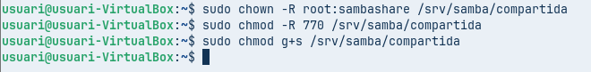 

Justificación:

* Se ajustan los permisos reales en Linux
* Se aplica el bit SGID para que los archivos hereden el grupo

Resultado final:

* samba1 puede leer y escribir
* samba2 solo puede leer
* samba3 no tiene acceso

***

Perfecto, tienes toda la razón. Eso que has descrito es parte importante del flujo real de la práctica y hay que documentarlo porque demuestra que has validado el funcionamiento completo.

Te lo dejo bien redactado para que lo añadas en tu guía justo después de los comandos de permisos, manteniendo tu estilo técnico y natural.

***

### 9. Ajuste final y verificación de la carpeta compartida

Después de corregir los permisos del sistema, es necesario aplicar los cambios y verificar el funcionamiento desde el cliente.

Se reinicia el servicio de Samba:

```
sudo systemctl restart smbd
```

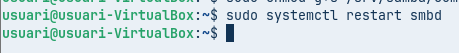 

En el cliente Windows, se eliminan las sesiones activas para evitar el uso de credenciales en caché:

```
net use * /delete
```

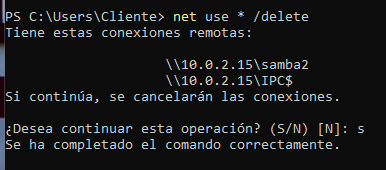 

A continuación, se accede desde el explorador de archivos a:

```
\\10.0.2.15\compartida
```

Se realizan las siguientes comprobaciones:

* Con el usuario **samba1**:
  * Acceso correcto
  * Puede visualizar los archivos
  * Puede modificar y guardar sin errores
  
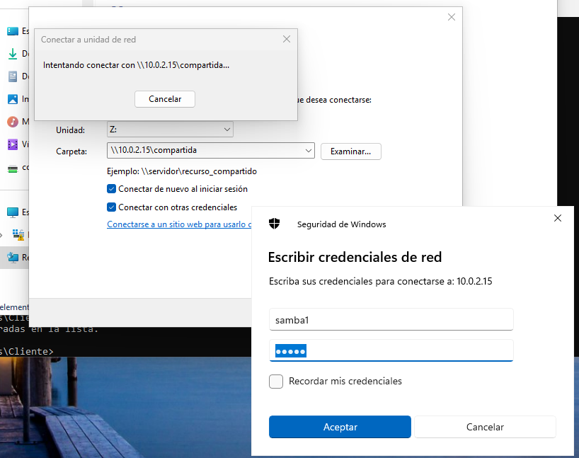 

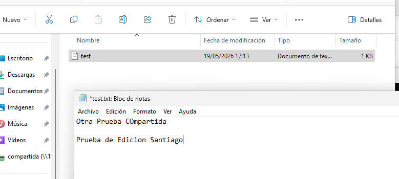 

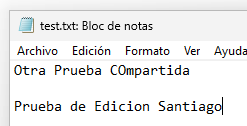 

* Con el usuario **samba2**:
  * Acceso correcto
  * Puede visualizar los archivos
  * No puede modificar ni guardar (permiso de solo lectura)


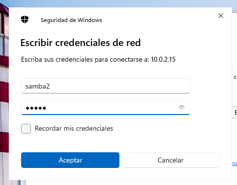 

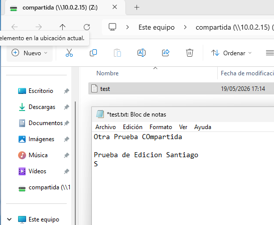 

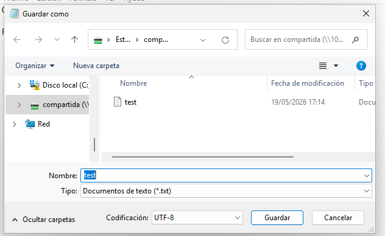 

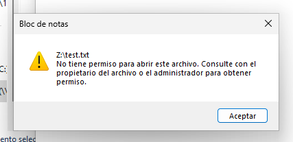 

* Con el usuario **samba3**:
  * Acceso denegado al recurso

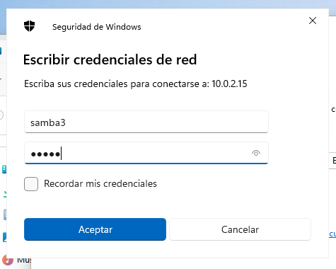 

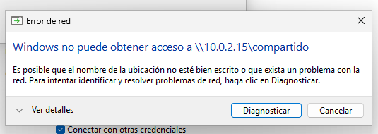 


Esto confirma que los permisos definidos en Samba y en el sistema están funcionando correctamente.

***

### 10. Bloqueo de archivos ZIP

Para restringir el acceso a archivos comprimidos, se modifica la configuración del recurso compartido.

Se edita el archivo de configuración:

```
sudo nano /etc/samba/smb.conf
```

Y se añade dentro del bloque `[compartida]`:

```
veto files = /*.zip/
```


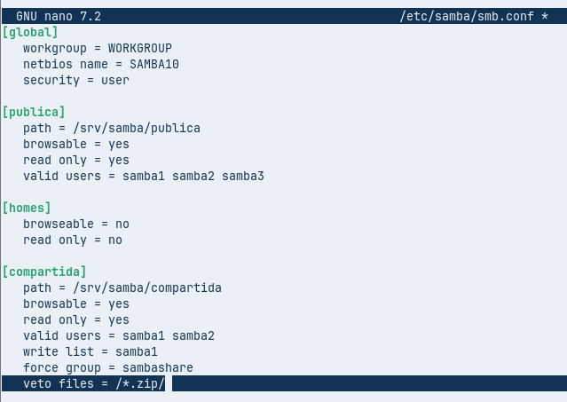 

Se valida la configuración:

```
testparm
```

 

Y se reinicia el servicio:

```
sudo systemctl restart smbd
```

 

Se crea un archivo de prueba en el servidor:

```
sudo touch /srv/samba/compartida/prueba.zip
```

 

***

### 11. Verificación

Desde el cliente Windows:

```
\\10.0.2.15\compartida
```

Resultado:

* El archivo `.zip` no aparece en el explorador
* Otros archivos (como `.txt`) sí son visibles


 

Desde el servidor (Zorin), se puede comprobar que el archivo sigue existiendo:

```
ls /srv/samba/compartida
```

Resultado:

* Se muestra tanto el `.txt` como el `.zip`

 

***

### Justificación

La directiva `veto files` permite filtrar tipos de archivo para los clientes Samba, evitando su visualización o acceso, aunque estos continúen existiendo físicamente en el sistema.

## 10. Conclusiones

Durante la práctica se ha comprobado la importancia de diferenciar dos niveles:

1. Configuración de Samba (control de acceso)
2. Permisos del sistema Linux (control real de lectura/escritura)

El principal problema encontrado fue la discrepancia entre ambos niveles, especialmente en los permisos de archivos existentes. La solución se basó en ajustar correctamente propietarios, permisos y herencia de grupo.

El sistema final cumple todos los requisitos:

* Acceso controlado por usuarios
* Separación de permisos
* Funcionamiento completo desde Windows

En conclusión, la configuración es funcional, segura y acorde a los objetivos planteados.
